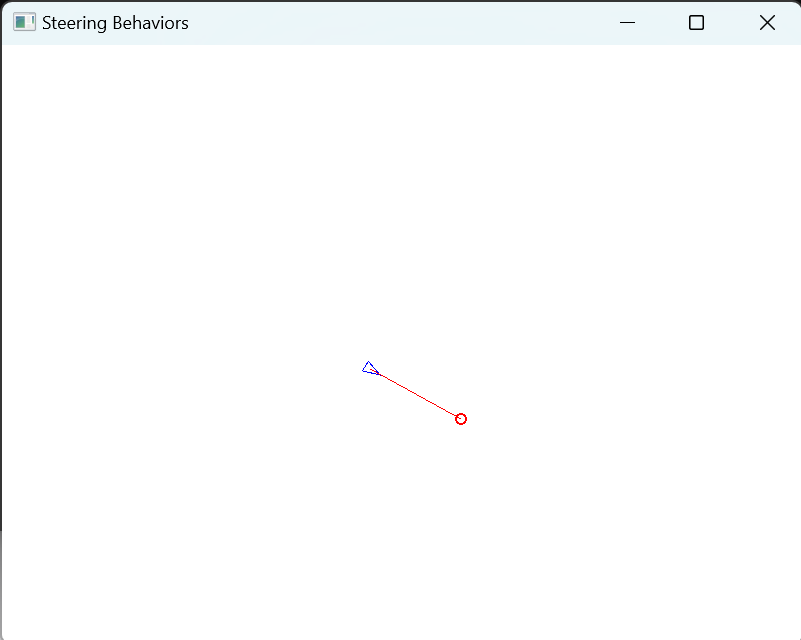
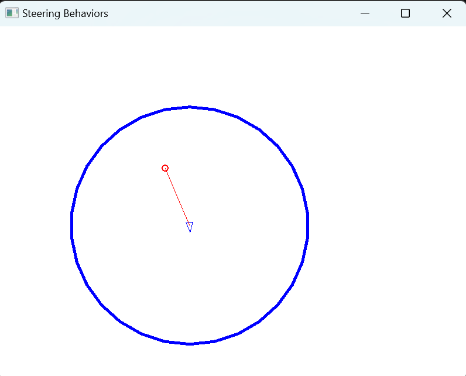
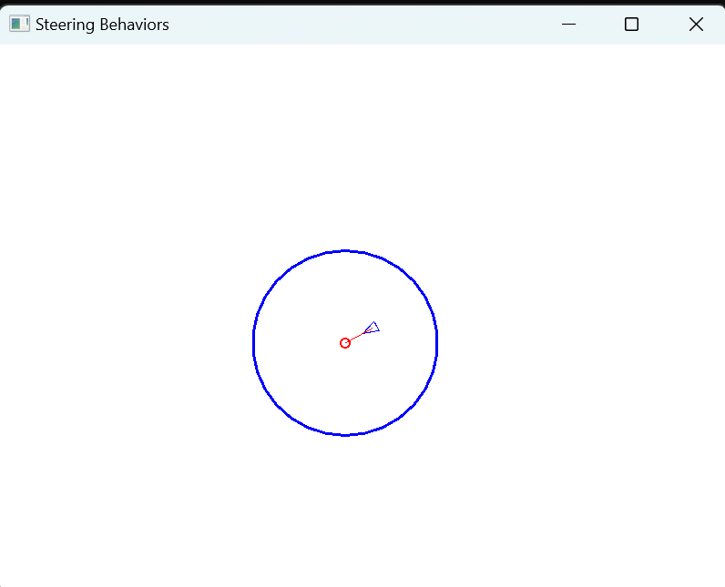

# Basic Steering behavior

https://github.com/cloud-sail/BasicSteeringBehavior

## Overview

This project implements basic steering behaviors, including seek, flee, and arrive, inspired by the principles outlined in Craig Reynolds' 2002 paper, "Steering Behaviors For Autonomous Characters." Developed using C++ and SFML, this simulation aims to demonstrate the dynamic steering behaviors in autonomous agents.

## Key Features

- **Basic Steering Behaviors**: Implementation of fundamental behaviors like seek, flee, and arrive.
- **Modular Scene Management**: `SceneManager.cpp` allows switching between different game scenes by pressing different number keys, showcasing various steering behavior examples.
- **Scene Interface**: Defined in `Scene.h`, it outlines essential methods for different game scenes, including `handleInput`, `update`, and `render`.
- **Vector2D Utility**: `Vector2DUtility.h` provides vector processing functions utilized in the project, such as vector length, normalization, truncation, confinement, and distance calculation between two points.
- **Vehicle and SteeringManager Classes**:
  - **Vehicle**: Represents an agent, containing attributes like position, velocity, maximum allowed speed, and maximum force. It renders the agent as a triangle.
  - **SteeringManager**: Designed based on the concept that steering can be a resultant force of multiple steering behaviors. It uses a bit mask to enable or disable different steering behaviors and renders various auxiliary lines based on the mode.

## Structure

- `Main.cpp`: Contains the main game loop.
- `SceneManager.cpp`: Manages the switching of game scenes to display different steering behaviors.
- `Scene.h`: Defines the interface for game scenes.
- `Vector2DUtility.h`: Implements vector operations used throughout the project.
- `Vehicle`: A class that encapsulates the properties and functionalities of an autonomous agent.
- `SteeringManager`: Manages the combination and execution of various steering behaviors.

## Sample
### Seek

### Flee

### Arrive
